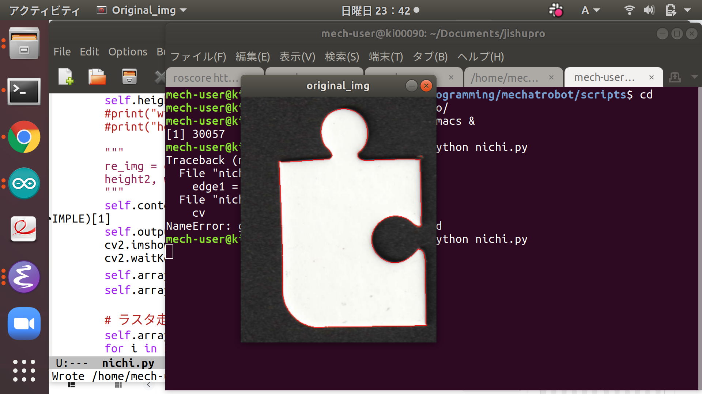
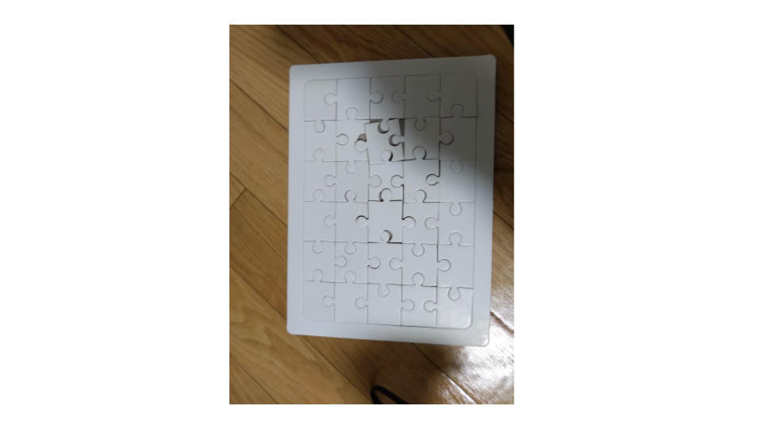
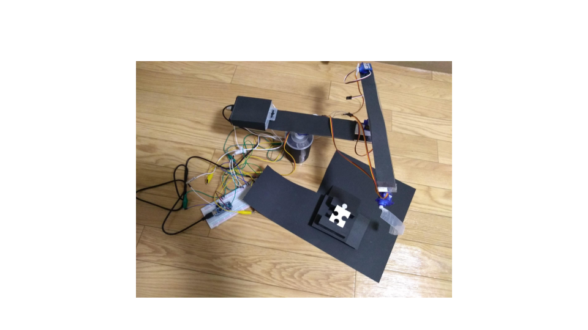

# Solve-Jigsaw-puzzle

This repository uses OpenCV for image binarization, contour extraction, and the G-operation proposed by Gallus for finding the global curvature of a continuous curve to recognize the unevenness of a jigsaw puzzle. From the unevenness information of each of its pieces, the jigsaw puzzle is solved by depth-first search(`nichi.py`).

Then, from the obtained solution of the jigsaw puzzle, the jigsaw puzzle is transported by a horizontal articulated robot arm using inverse kinematics calculation and servo motor control by rosserial and Arduino.
